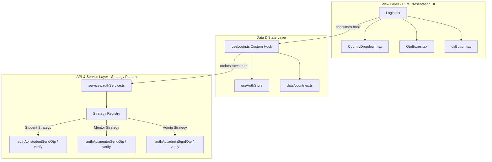

# Frontend Architecture Guide — GenLab Launchpad LMS

This document outlines the **3-Tier Architecture** established for the GenLab Launchpad LMS frontend application (`app/frontend`). All developers must follow these architectural principles when building, maintaining, or extending features.

---

## Architecture Diagram

---

## Layer Responsibilities & Engineering Rules

### 1. View Layer (`src/components/`, `src/components/ui/`)

- **Purpose**: Pure visual rendering and user interaction interface.
- **Technologies**: React 19, Hero UI primitives, Tailwind CSS.
- **Engineering Rules**:
  - **No Direct API Calls**: Presentation components MUST NOT import or invoke `authApi`, `axios`, or service logic directly.
  - **No Complex Business Logic**: Keep components presentational. State orchestration and handlers must be passed in from custom hooks.
  - **Reusability**: Smaller UI components (e.g., `OtpBoxes.tsx`, `CountryDropdown.tsx`, `Button.tsx`) should be focused, single-responsibility components with strict TypeScript props interfaces.

---

### 2. Data & State Layer (`src/hooks/`, `src/store/`, `src/data/`)

- **Purpose**: Form state management, validation logic, user input formatting, and global application state.
- **Technologies**: React Custom Hooks (`useLogin`), Zustand (`useAuthStore`), static configuration constants (`countries.ts`).
- **Engineering Rules**:
  - **Custom Hooks for Feature State**: Complex UI forms or views should encapsulate state and event handlers within custom hooks (e.g., `useLogin.ts`).
  - **Zustand for Global State**: Store persistent application-wide state (such as active auth session, theme preferences, navigation state) in Zustand stores under `src/store/`.
  - **Separation from UI**: Business calculations (e.g., input pattern checks, country code prefixing) live in custom hooks or pure helper functions, keeping components light.

---

### 3. API & Service Layer (`src/services/`, `src/api/`)

- **Purpose**: Backend communication, domain services, strategy selection, payload formatting, and API error normalization.
- **Technologies**: Axios client (`src/api/client.ts`), endpoints definitions (`src/api/`), Strategy Pattern (`src/services/authService.ts`).
- **Engineering Rules**:
  - **Strategy Pattern for Extensibility**: Use strategy registries (e.g., `RoleAuthStrategy`) for operations that branch based on roles, types, or protocols. Adding new strategies should never require modifying core control flow.
  - **Axios Isolation**: Raw network requests and REST endpoint definitions reside exclusively inside `src/api/`.
  - **No UI Imports**: Service files MUST NOT import React, hooks, or presentation components.

---

## Testing Standards (`src/**/__tests__/`)

- **Framework**: Vitest (`npm run test:run`)
- **Structure**: Tests are organized inside `__tests__/` subdirectories in their respective layer:
  - `src/api/__tests__/` (API endpoint unit & integration tests)
  - `src/services/__tests__/` (Service logic & strategy pattern tests)
  - `src/hooks/__tests__/` (State & input logic tests)
  - `src/components/__tests__/` (Presentational component tests)

---

## Commands

| Command | Action |
| :--- | :--- |
| `npm run dev` | Start local development server |
| `npx tsc --noEmit` | Run strict TypeScript type checks |
| `npm run test:run` | Run complete Vitest test suite |
| `npm run build` | Compile production bundle |
