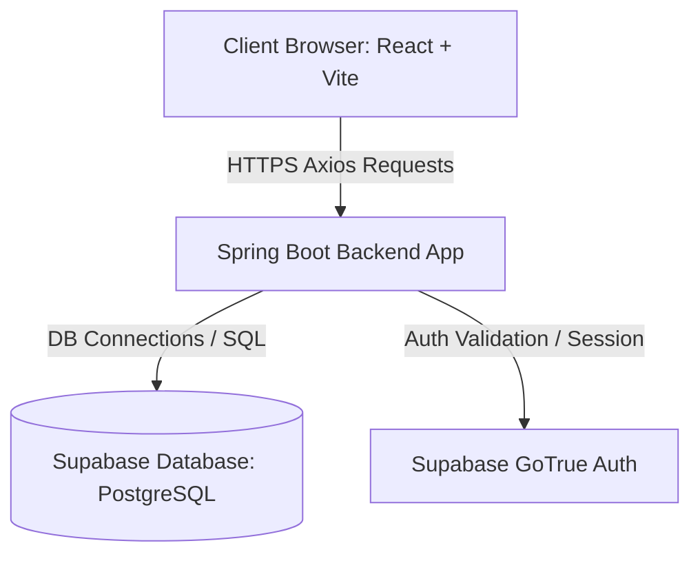
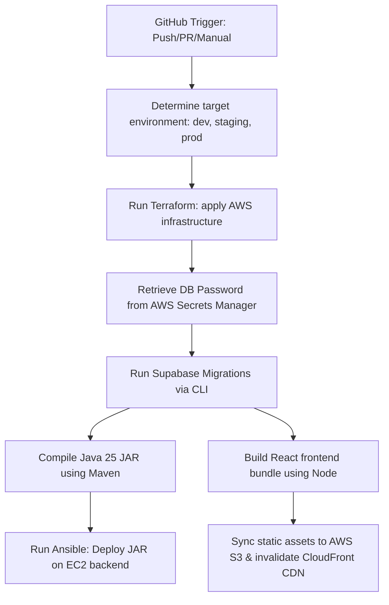

# High Level Design (HLD) - GenLab Launchpad LMS

## 1. System Architecture Diagram

---

## 2. Component Decoupling & Communication Constraints

### 2.1. API Proxy Enforce
- The frontend **MUST NOT** communicate with the database/Supabase directly. 
- All communication (including authentication status verification and data CRUD) is proxied exclusively through backend Spring Boot API controllers.

### 2.2. Object Decoupling
- Spring Boot controllers expose clean Data Transfer Objects (DTOs) for requests and responses.
- Decouple internal database JPA entities from DTO structures to prevent leaks and make schema refactoring easier.

---

## 3. Technology Stack & Key Layers

### 3.1. Frontend Application
- **Framework**: React 19 + Vite 8 + TypeScript 6.0.
- **Layout & Navigation**: Structured dark sidebar featuring GenLab branding, bottom `Collapse <<` toggle button, and four main category groups (`OVERVIEW`, `DIRECTORY`, `OPERATIONS`, `FINANCIALS`).
- **Schedule Inspector**: A dedicated daily operational hub (`/admin/schedule-inspector`) under `OPERATIONS` displaying slots as simple cards, grouped by mentor and sorted chronologically. Custom Tailwind CSS and Hero UI elements are used instead of `react-big-calendar`.
- **Inspector Controls & States**: Page header incorporates a native date picker (`DD-MM-YYYY`), manual refresh action button, backend disconnection alert banner (`Failed to connect to the backend server to retrieve schedule details.`), and a centered empty state card (`No Active Slots Found` - `There are no active student enrollments scheduled for the date YYYY-MM-DD.`).
- **Date Filter Adapter**: A dedicated mapping utility handles filtering active schedules client-side, matching them to the selected date by comparing `startDate` and `endDate`.
- **Global State**: Zustand stores representing domain states (students, courses, slots, payments).
- **HTTP Client**: Axios configured with custom middleware for token extraction and proxy routing.

### 3.2. Backend Application
- **Runtime & Framework**: Java 25 + Spring Boot 4.1.0 + Spring Security + Spring WebFlux.
- **Database Connector**: Spring Data JPA.
- **Cache Management**: Caffeine Cache with 10 min TTL / 1000 max size for role mappings.
- **Config Management**: spring-dotenv for automatic `.env` properties resolution.
- **Object Storage Integration**: AWS SDK S3 client config for secure uploading and retrieval URL generation for user documents and photos.

### 3.3. Database & Authentication
- **Provider**: Supabase.
- **Engine**: PostgreSQL 17.
- **Identity & OTP Auth**: Supabase GoTrue Auth integration.

### 3.4. Infrastructure & CI/CD
- **Cloud Provider**: Amazon Web Services (AWS) in the `ap-south-1` region.
- **Infrastructure as Code (IaC)**: Terraform 1.5.0, utilizing an `enable_web_hosting` flag in the frontend module to switch between CDN-only and apex/www site hosting routes.
- **Configuration Management**: Ansible.
- **Secret Storage**: AWS Secrets Manager.
- **CI/CD Runner**: GitHub Actions.
- **Asset/Object Storage**: AWS S3 Bucket provisioned and mapped for secure storage and serving of user uploaded images (profile photos, address proofs).

---

## 4. Deployment Workflow & CI/CD Pipeline
The deployment workflow is fully automated through a GitHub Actions workflow (`.github/workflows/infra-deploy.yml`).

### 4.1. Execution Rules
- **Push Trigger**: Job execution is optimized using path filters.
  - **Backend compile/deploy** runs only if changes are detected in `app/backend/`.
  - **Frontend build/deploy** runs only if changes are detected in `app/frontend/`.
  - **Supabase migrations** execute only if changes are detected in `deployments/supabase/`.
  - **Terraform configuration** runs if any deploy job is triggered or if infrastructure code changes.
- **Manual Trigger** (`workflow_dispatch`): Bypasses all filters to force-build and deploy all components simultaneously.

### 4.2. Pipeline Flow Diagram

---

## 5. Architectural Guidelines & Design Principles
- **Core Principles**: Strict adherence to SOLID (high priority), KISS, and DRY principles across all development boundaries (backend codebase, frontend application, and database designs). Always follow these principles while writing any code.

