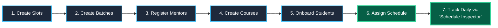
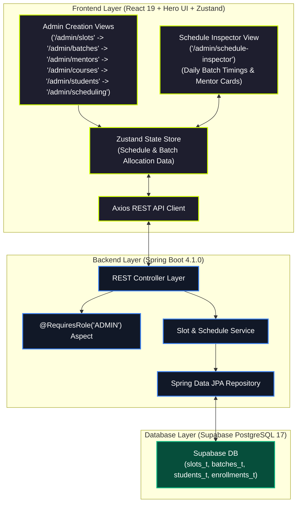
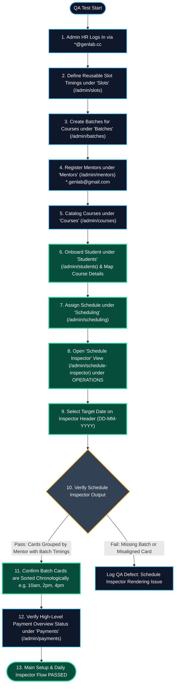
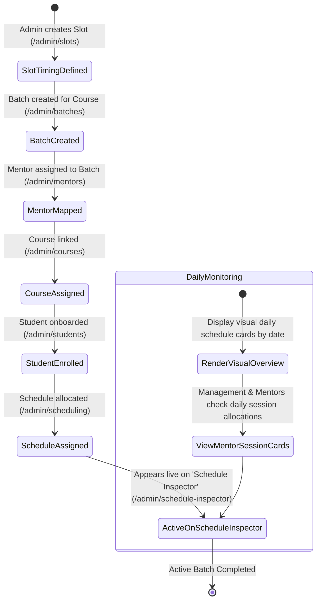
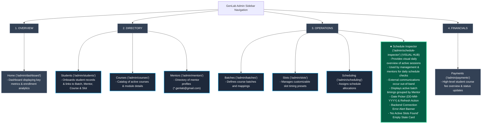
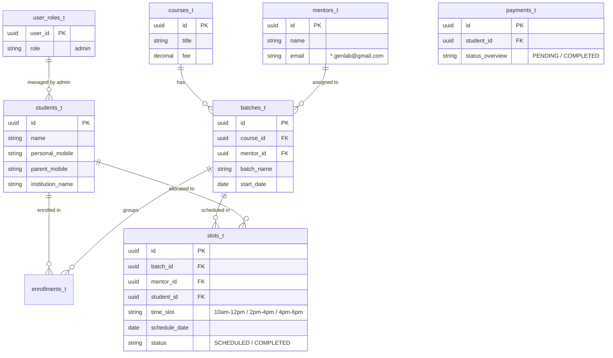

# GenLab Launchpad LMS — Phase 1 QA Testing & User Flow Guide

> **Target Audience:** Quality Assurance Engineers, Testers, & Product Verification Leads  
> **Phase Scope:** **Phase 1 — HR Admin Slot Allocation & Daily Schedule Inspector**  
> **Core Objective:** Solve HR's toughest operational pain point (unstructured scheduling) by providing a step-by-step creation flow that feeds into the **Schedule Inspector** tab for daily slot & batch monitoring.  
> **Last Updated:** July 2026  

---

## Executive Summary & Core Operational Sequence

Phase 1 focuses on solving one problem at a time. For HRs, **scheduling student slots and managing batch timings is their single most difficult and time-consuming task** due to previous unstructured manual processes.

### 🔄 The Main Admin Operational Sequence:

### 📌 Feature Status Matrix for Phase 1 Testing:

| Sector / Navigation Menu | Phase 1 Status | Scope & Purpose for QA |
| :--- | :--- | :--- |
| **Scheduling** (`OPERATIONS`) | **CORE FEATURE (Highest Priority)** | **Primary Scheduling Engine (`/admin/scheduling`).** Assigning & coordinating schedule allocations, student slot mappings, batch timings, and mentor availability. |
| **Schedule Inspector** (`OPERATIONS`) | **CORE FEATURE (Highest Priority)** | **Visual Daily Overview Hub (`/admin/schedule-inspector`).** Provides a visual daily overview of active sessions for management and mentors (external notifications occur out-of-band), grouped by mentor with date picker, refresh control, error banner, and empty state handling. |
| **Students Onboarding** (`DIRECTORY`) | **ACTIVE (High Priority)** | **Single Admin Student Form (`/admin/students`).** Onboarding new students, collecting personal/contact/academic details, and mapping them to course, mentor, batch, and slot schedule. |
| **Batches & Slots** (`OPERATIONS`) | **ACTIVE** | Defining reusable slot timings (10am-12pm, 2pm-4pm, 4pm-6pm) under `/admin/slots` and creating course batches (`/admin/batches`). |
| **Mentors & Courses** (`DIRECTORY`) | **ACTIVE** | Registering mentor profiles (`/admin/mentors`, `*.genlab@gmail.com`) and cataloging active course offerings (`/admin/courses`). |
| **Payments** (`FINANCIALS`) | **OVERVIEW ONLY** | Basic payment overview/summary flag only (`/admin/payments`). Deep granular payment logic is deferred. |
| **Home / Analytics** (`OVERVIEW`) | **ACTIVE** | Top-level platform enrollment stats and slot metrics overview (`/admin/dashboard`). |
| **Student & Mentor Portals** | ⏸️ **ON HOLD** | Student phone OTP (`/student/dashboard`) & Mentor login portals (`/mentor/dashboard`) are paused for future phases. |
| **AWS S3 File Storage** | ⏸️ **ON HOLD** | Document file upload storage is paused for Phase 1. |

---

## 1. Phase 1 High-Level System Architecture

This diagram shows how the Admin creation pipeline builds schedule data that is rendered on the **Schedule Inspector** view (`/admin/schedule-inspector`) via the Spring Boot REST backend proxy and Supabase database.

---

## 2. Main Admin Flow — Step-by-Step QA Decision Tree

QA Testers should execute and verify the end-to-end flow in this exact chronological order.

---

## 3. Single Phase 1 Admin Schedule Lifecycle

This state machine details how a student slot & batch setup progresses from initial definition to active daily monitoring.

---

## 4. Sector Breakdown & Daily Operational Hub

The dashboard navigation maps directly to the Admin's setup sequence across four core category groups, ending at their daily primary screen: **Schedule Inspector**.

---

## 5. Phase 1 Data Model for Schedule Inspector

Schema entity relations supporting the batch creation pipeline and Schedule Inspector output.

---

## 6. QA Test Execution Matrix

### 6.1 Highest Priority: Daily Schedule Inspector (`/admin/schedule-inspector`)
- [ ] **Daily Inspector View Loading:** Open `OPERATIONS` $\rightarrow$ `Schedule Inspector` (`/admin/schedule-inspector`). Confirm page header renders title, subtitle, date selector, and sync/refresh button.
- [ ] **Date Picker Selector:** Change date using native date picker (`DD-MM-YYYY`, e.g. `06-07-2026`). Confirm active slot allocations re-filter dynamically for the chosen date (`startDate <= selectedDate && endDate >= selectedDate`).
- [ ] **Manual Refresh Control:** Click the sync/refresh button next to the date input. Verify slot data re-fetches from the REST backend.
- [ ] **Backend Disconnection Banner:** Simulate offline/disconnected backend. Verify high-visibility pink alert banner displays: `Failed to connect to the backend server to retrieve schedule details.`
- [ ] **Empty State Component:** Select a date with zero active enrollments. Verify centered card displays `No Active Slots Found` with text `There are no active student enrollments scheduled for the date YYYY-MM-DD.`
- [ ] **Mentor Grouping & Card Order:** Confirm active slot cards are grouped distinctly under assigned Mentors and sorted chronologically (e.g. 10:00 AM before 02:00 PM).

### 6.2 Sidebar Navigation & Category Layout
- [ ] **4-Category Organization:** Verify dark sidebar items are organized into four category headings: `OVERVIEW` (`/admin/dashboard`), `DIRECTORY` (`/admin/students`, `/admin/courses`, `/admin/mentors`), `OPERATIONS` (`/admin/batches`, `/admin/slots`, `/admin/scheduling`, `/admin/schedule-inspector`), `FINANCIALS` (`/admin/payments`).
- [ ] **Collapsible Sidebar:** Click `Collapse <<` button at the bottom of the sidebar. Confirm sidebar collapses/expands smoothly.

### 6.3 Setup Sequence Verification
- [ ] **Sequential Creation:** Test creating in order: `Slots` (`/admin/slots`) $\rightarrow$ `Batches` (`/admin/batches`) $\rightarrow$ `Mentors` (`/admin/mentors`) $\rightarrow$ `Courses` (`/admin/courses`) $\rightarrow$ `Students` (`/admin/students`) $\rightarrow$ `Scheduling` (`/admin/scheduling`).
- [ ] **Mentor Email Validation:** Ensure mentor email strictly matches `*.genlab@gmail.com`.
- [ ] **Student-to-Batch Mapping:** Onboard a student and assign them to an active batch & slot. Confirm they appear under that batch on the Schedule Inspector for active dates.

### 6.4 Financials & Scope Boundaries
- [ ] **Payment Overview:** Verify `FINANCIALS` $\rightarrow$ `Payments` (`/admin/payments`) displays a basic overview/flag only. Confirm no complex payment gateway or installment breakdown errors break the view.
- [ ] **Admin Authentication:** Verify access requires `@genlab.cc` Admin sign-in. Confirm student (`/student/dashboard`) and mentor (`/mentor/dashboard`) sign-in routes are disabled/on-hold.

---

> **QA Lead Operational Summary:** HRs use the sequential flow (Slots $\rightarrow$ Batches $\rightarrow$ Mentors $\rightarrow$ Courses $\rightarrow$ Students $\rightarrow$ Scheduling) to set up data, then use **Schedule Inspector** under `OPERATIONS` (`/admin/schedule-inspector`) daily to manage batch timings and mentor slot availability.
