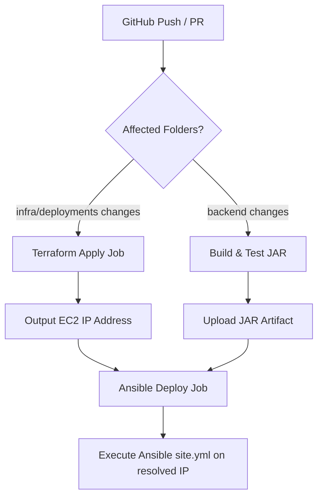

## Context

Deploying the monorepo application to AWS requires structured Infrastructure-as-Code (IaC), robust host configuration scripts, and a secure deployment runner. Since the React frontend consists of static files and the Spring Boot backend runs on the JVM, their hosting solutions must be logically separate. Database state must also be decoupled from application compute state to prevent configuration drift and data loss.

## Goals / Non-Goals

**Goals:**
- Propose a reusable Terraform module layout for compute, database, and static hosting.
- Provide Ansible playbooks for environment setup, SSL configuration, and systemd management.
- Establish GitHub Actions workflows to automate and orchestrate the transition from Terraform updates to application deploys.

**Non-Goals:**
- Configuring elastic load balancing or autoscaling groups (focusing on target base-case VM compute architecture).
- Provisioning dynamic container hosting (ECS/EKS) since Spring Boot runs directly on EC2.

## Decisions

### 1. Recommended Directory Structure
```text
deployments/
├── terraform/
│   ├── modules/
│   │   ├── database/                  # RDS, subnet groups, security configurations
│   │   ├── backend/                   # EC2 instance, security groups, Route 53
│   │   └── frontend/                  # S3 bucket static site, ACM certificates, CloudFront
│   └── environments/
│       ├── dev/                       # Root composition module for Development
│       │   ├── main.tf
│       │   ├── outputs.tf
│       │   └── variables.tf
│       └── prod/                      # Root composition module for Production
│           ├── main.tf
│           ├── outputs.tf
│           └── variables.tf
└── ansible/
    ├── group_vars/                    # Environment-specific properties (non-sensitive)
    ├── roles/
    │   ├── common/                    # Installs Java OpenJDK
    │   ├── nginx/                     # Installs & sets reverse proxy
    │   ├── certbot/                   # Issues SSL and automates renew
    │   └── spring-boot/               # Handles JAR file copy, systemd script setup
    └── site.yml                       # Main execution playbook
```

### 2. Terraform Module Outputs and Inputs Design
* **Database Module**:
  * **Inputs**: VPC subnet IDs, permitted ingress security group CIDRs, `application_tag` (map of string).
  * **Outputs**: `database_endpoint`, `database_port`, `database_security_group_id`.
* **Backend Module**:
  * **Inputs**: AMI ID, subnet ID, key pair name, database security group ID (for network allowance), `application_tag` (map of string).
  * **Outputs**: `instance_public_ip`, `instance_private_ip`, `route53_domain_name`.
* **Frontend Module**:
  * **Inputs**: Domain name, hosted zone ID, `application_tag` (map of string).
  * **Outputs**: `s3_bucket_name`, `cloudfront_distribution_id`.

### 3. AWS myApplication & AppRegistry Billing Integration
To group all components into AWS Console's `myApplication` view:
- Create an `aws_servicecatalogappregistry_application` and `aws_servicecatalogappregistry_attribute_group` in the environment root layer.
- Retrieve the application ARN and build the tracking tag mapping: `{"awsApplication" = "arn:aws:resource-groups:..."}`.
- Every submodule accepts this map as `application_tag` and merges it into all taggable resources:
  ```hcl
  tags = merge(var.custom_tags, var.application_tag)
  ```
- This enables Cost Explorer and CloudWatch Application Manager to track resources holistically.

### 4. Ansible Role Responsibilities
* **common**: Guarantees `openjdk-17-jdk` (or matching runtime) is installed on the host.
* **nginx**: Sets configuration to forward port 80/443 traffic to the local Spring Boot application port (e.g., `http://127.0.0.1:8080`).
* **certbot**: Requests a Let's Encrypt certificate for the domain.
* **spring-boot**: Mounts systemd scripts in `/etc/systemd/system/spring-app.service` ensuring proper lifecycle management:
  ```ini
  [Service]
  ExecStart=/usr/bin/java -jar /var/www/spring-app/app.jar
  Restart=always
  User=springapp
  ```

### 4. Git-Safe Secret Handling
* Database root credentials and SSH keys SHALL NOT be written to source control.
* Terraform secrets will be injected via `TF_VAR_` environment variables in GitHub Actions.
* Ansible connection credentials will use GitHub-managed runner secrets (e.g., `SSH_PRIVATE_KEY`) injected dynamically during execution.

### 5. Parameterized Domain Configuration & Migration Architecture
To support easy migration and structured environmental domain isolation:
- The base production domain is configured via the root parameter `root_domain_name = genlablaunchpad.cc`.
- **Production URL mappings**:
  - Frontend: `www.${root_domain_name}` (or `${root_domain_name}`)
  - Backend: `api.${root_domain_name}`
- **Development URL mappings**:
  - Frontend: `dev.${root_domain_name}` (constructed dynamically as `dev.prod_url`)
  - Backend: `api.dev.${root_domain_name}` (constructed dynamically as `api.frontend_domain`)
- Route 53 provisions the corresponding `A` record for the backend subdomains, and CloudFront handles aliases for the frontend subdomains. Nginx virtual hosts are dynamically generated by Ansible for the exact environment backend domain (`api.dev.${root_domain_name}` or `api.${root_domain_name}`).
- Hosted zones are looked up dynamically using `data "aws_route53_zone" "primary" { name = var.dns_zone_name }` instead of static zone IDs.
- Frontend React uses build-time variables pointing to the environment's specific API domain (`REACT_APP_API_URL`) and Spring Boot reads CORS parameters allowing traffic from the matching frontend domain mapped via Ansible, preventing domain names from being hardcoded inside application logic binaries.

### 6. Multi-Environment Isolation, Staging Extensibility & Supabase Toggle
The architecture supports dedicated deployment definitions for `dev` and `prod` environments, designed with strict modularity so that a `staging` environment can be added later with minimal configuration changes:
* **Frictionless Staging Environment Creation**:
  - **Terraform**: To add staging, developers only need to create a new folder `deployments/terraform/environments/staging/` and define a root composition module calling the shared `modules/` with staging parameters (e.g., `domain_name = "staging.genlablaunchpad.cc"`).
  - **Ansible**: Developers add a `[staging]` host group to the Ansible inventory and create `deployments/ansible/group_vars/staging.yml` containing staging domain, database, and systemd properties.
  - **GitHub Actions**: The orchestration workflow `.github/workflows/infra-deploy.yml` consumes a parameterized target environment input, which can be dynamically resolved from branch contexts (e.g., `main` branch targets `prod`, `release/*` or a `staging` branch targets `staging`, and other branches trigger `dev`).
* **Frontend, Backend, and DB separation**: Handled by deploying distinct root composition modules (`environments/dev`, `environments/prod`, and later `environments/staging`), mapping configuration values to their respective isolated resources.
* **Supabase Project-level Routing**:
  - Standard static deployments resolve the target project dynamically using the environment name suffix (e.g., `<project-name>-dev`, `<project-name>-prod`, and later `<project-name>-staging`), mapping configuration values to isolated cloud project instances.
  - Migration triggers push schemas directly to these target project instances using the corresponding environment CLI keys.
* **Supabase Branch-level Routing**:
  - When the CI/CD pipeline triggers on a non-trunk Git branch, it can toggle `SUPABASE_DEPLOY_MODE` to `"branch"`.
  - The pipeline dynamically provisions a branch-level DB sandbox using the Supabase CLI (`supabase db branch create <branch>` or `supabase db push --branch <branch>`), keeping sandbox migrations isolated from the static dev/staging/prod root environments.

### 7. Deployment Orchestration Sequencing (GitHub Actions)
The CI/CD orchestration setup handles both automated provisioning/deployments and automated teardowns for cost optimization:
* **Provisioning and Deployment**:
  - Triggers on pushes to `main` (representing successful merges into production) or pushes/PRs targeting `dev`. Sequences Terraform applies, Spring Boot builds, and Ansible configurations.
* **Automated Teardown (Cost Optimization)**:
  - Triggers on `pull_request` events with type `closed` for non-prod branches.
  - Automatically executes `terraform destroy` in the target environment (e.g., `dev` or `staging`) to eliminate idle EC2 and RDS instances when validation is complete.
  - Executes `supabase db branch delete <branch>` to clean up dynamic database branches.
  - Supports a manual `workflow_dispatch` trigger with an `action` input to allow developers to trigger `destroy` manually on demand.



## Risks / Trade-offs

- **DNS and Certificate Issuance Deadlock**: Let's Encrypt / Certbot requires the Route 53 domain name to already resolve to the EC2 host IP address before certificate validation succeeds.
  - **Mitigation**: The GitHub Actions workflow must wait for Route 53 resource record propagation immediately after the Terraform Apply step before launching Ansible.
